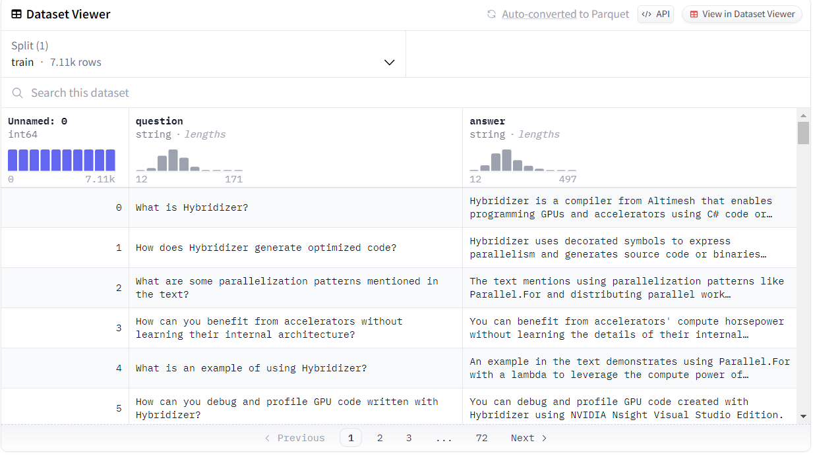
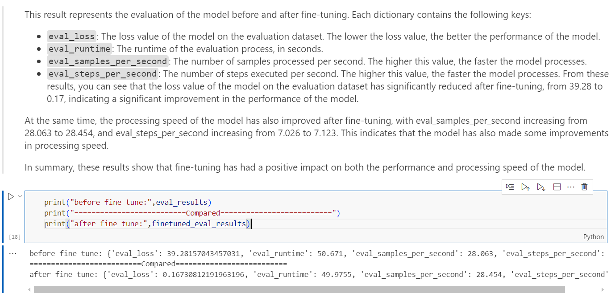
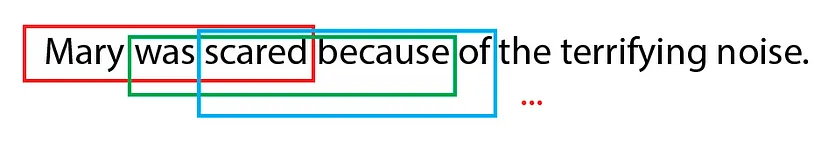
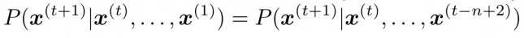
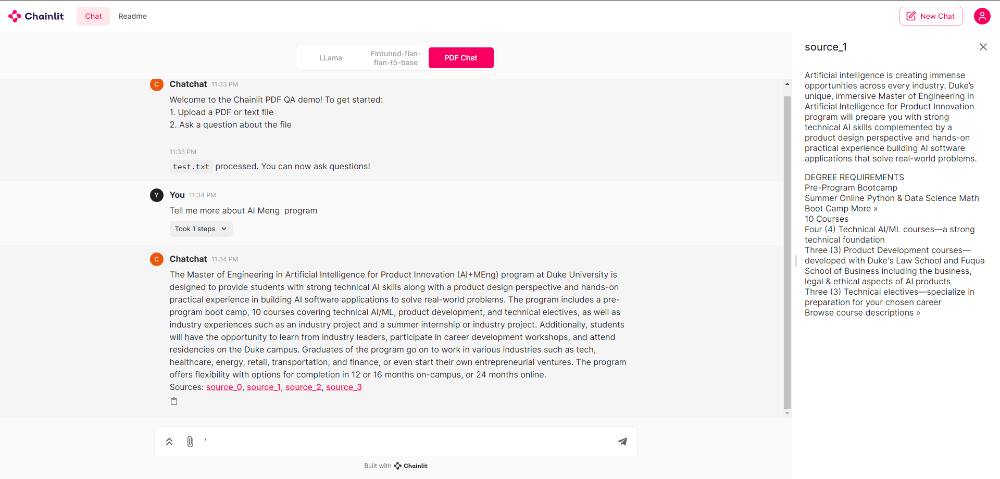

# Chatchat
## Problem Statement
In the era of information overload, where accessing specific and accurate answers to complex questions is both challenging and time-consuming, there is a growing need for advanced solutions. To address this, I propose the development of a cloud-based Question and Answer (Q&A) system, which is a multifunctional integrated LLM application that offer different solutions for different tasks.
## Previous Efforts
[Ollama](https://ollama.com/), a useful tool for getting up and running with large language models locally. It is easy for integrating diffrent LLM locally, but is does not offer the solution combination of different tasks. Developing LLM application also always encounter difficult problems. e.g. 
- Cost 
    - OpenAI API costs a lot and has limitations
    - Self deployed local LLM need powerful GPU
    - Hard to get started with
-Privacy
-Hallucination and outdated knowledge
-Task composability

Therefore, I tried to build a application that unified different workflow best practice and adapt to different LLMs according to the user requirements. In this app, I offered 3 features:

1. Local knowledge base + GPT-3.5 -- Solving the hallucination and data inaccurate.
2. Local LLM baseline(LLama2-7b-chat) -- Solving the privacy problem
3. Fintuned flan-t5 model -- Fintuned on specific QA dataset(Nvidia QA). Solving the cost problem, because it is light.

## Data Sources
The dataset I used for fintuning model is [nvidia-qa](https://huggingface.co/datasets/ajsbsd/nvidia-qa) It is nvidia documentation question and answer pairs Q&A dataset for LLM finetuning about the NVIDIA about SDKs and blogs. 


Also, I have some local mannuals in pdf format for RAG purpose.

## Data processing pipeline  
The project is structured with notebooks are mainly for EDA and all the code used in notebook can be found in the corresponding python script which is organized in function format.

Overall, the main data processing is **split train and test dataset** -> data cleaning(convert to lowercase, remove Remove HTML tags, punctuation and extra white spaces) -> tokenization

## Model Fine Tuning and Evaluation



The model was evaluated and result compared with metrics of **eval_loss**, **eval_runtime**, **eval_samples_per_second** and **eval_steps_per_second**. The result shows that it is pretty much better than original model.
| Metric | Before Fine Tune | After Fine Tune |
|--------|------------------|-----------------|
| eval_loss | 39.28157043457031 | 0.16730812191963196 |
| eval_runtime | 50.671 | 49.9755 |
| eval_samples_per_second | 28.063 | 28.454 |
| eval_steps_per_second | 7.026 | 7.123 |

## Traditional Non-DL Approach

Here, I compared with n-gram. The main idea of generating text using N-Grams is to assume that the last word (x^{n} ) of the n-gram can be inferred from the other words that appear in the same n-gram (x^{n-1}, x^{n-2}, … x¹), which is called **context**. So the main simplification of the model is that we do not need to keep track of the whole sentence in order to predict the next word, we just need to look back for **n-1** tokens.


However, compared with polular LLM, this kind of solution is much worse. The Non-DL approach usually cannot match the performance and flexibility of deep learning methods when dealing with complex language modeling tasks. 

## Interesting finding
There are almost no LLM App that can offer the different workflow and model selection(esprcially for opern-source LLM) as the user want. I aasumed that it is because differnet model has their own interface and loading logic. That is why,in this project, I tried my best to implement an unified adaption for different LLMs for user to choose. 

There is a problem that when the user call 


## Web
The device requirement: 
- Nvidia A10 GPU/ T4 GPU
- Other requirements from .env file
Start method: 
```bash
cd src
chainlit run web/main.py -w
```
