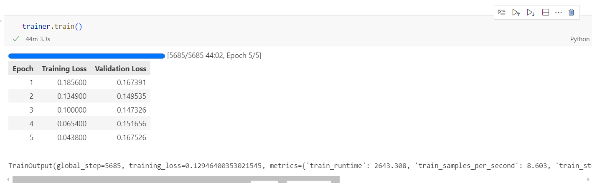
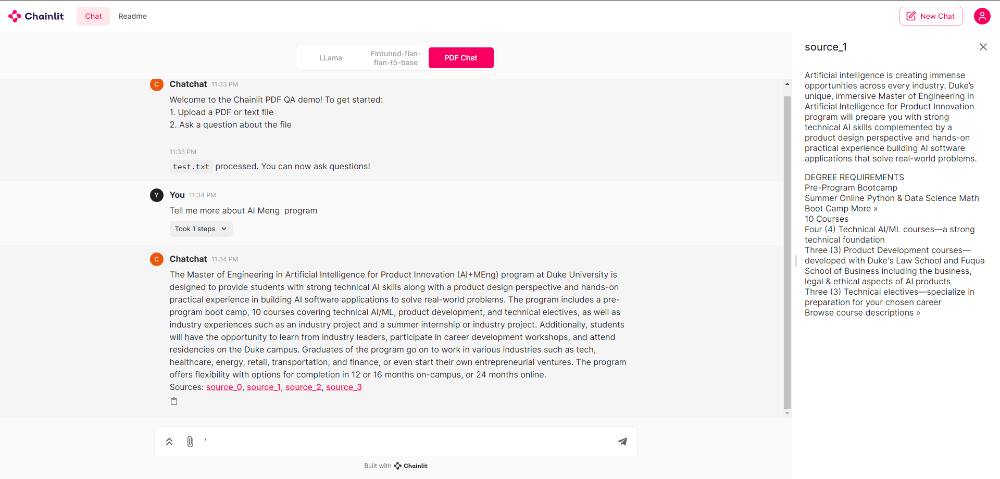

# Chatchat_AIMeng
AIPI540 Final Project
## Problem Statement
In the era of information overload, where accessing specific and accurate answers to complex questions is both challenging and time-consuming, there is a growing need for advanced solutions. To address this, I propose the development of a cloud-based Question and Answer (Q&A) system that harnesses the power of LLM , which is able to offer answers more accurately and quickly in specific fields.
## Previous Efforts
- Research: Recent research in NLP, especially in areas like BERT and GPT models, has significantly improved the understanding and generation of human-like text. Papers like "Attention Is All You Need" (Vaswani et al.) laid the foundation for models capable of contextual understanding.
- Commercial Products: Platforms like Quora, Stack Overflow, and IBM Watson demonstrate the commercial viability of Q&A systems. These platforms, however, rely heavily on community-driven content and manual curation.
- Data Sources
The system will utilize the following data sources:
1. Pre-Trained Language Models: OpenAI's GPTs or similar models like BERT for understanding and generating human-like responses. I am also
considering importing/fine-tuning more multimodal solutions to provide the feature that users can both ask questions in text or pictures.
2. Community Q&A Repositories: Datasets from platforms like Stack Exchange, which provide a wealth of structured Q&A pairs across various domains.
3. Specialized Knowledge Bases: Subject-specific databases for accurate, domain-specific information.
4. Duke Lectures’ PPT as domain knowledge.

## Model

## Web
